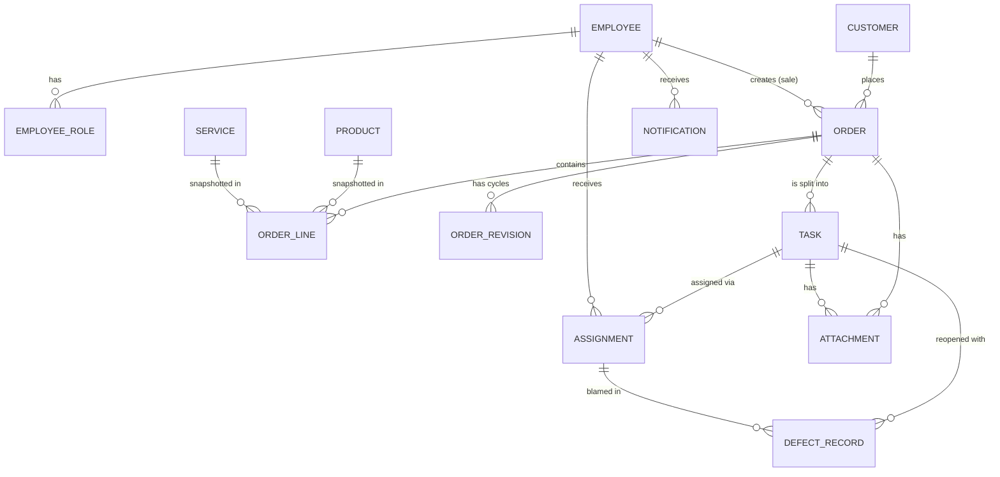

# Domain Model

Suy ra từ hoá đơn bán hàng, phiếu yêu cầu cài đặt – sửa chữa và bảng báo giá trong `Tài liệu tham khảo/`. Trường có đánh dấu ❓ là giả định — xem `OPEN_QUESTIONS.md`.

Quy ước chung cho mọi bảng: `id UUID PK`, `created_at`, `updated_at` (`timestamptz`), `version INT` (optimistic lock) cho thực thể có thể sửa. Tiền: `BIGINT` (VND). Số lượng: `NUMERIC(12,2)` (có mét dây, cuộn…).

## 1. Employee (Nhân viên) — `employees`
| Trường | Kiểu | Ràng buộc / ghi chú |
|---|---|---|
| code | varchar(20) | unique, vd `NV001` |
| full_name | varchar(120) | bắt buộc |
| email | citext | unique, dùng đăng nhập |
| phone | varchar(20) | chuẩn hoá chỉ chữ số, 10 số bắt đầu 0 |
| department | enum `MANAGEMENT`, `SALES`, `TECHNICAL` | bộ phận (thông tin tổ chức, KHÔNG quyết định quyền) |
| title | varchar(80) | chức danh hiển thị |
| password_hash | text | argon2id |
| must_change_password | bool | true khi Manager tạo/reset |
| is_active | bool | khoá tài khoản thay vì xoá |
| failed_login_count, locked_until | int, timestamptz | chống dò mật khẩu |

`employee_roles(employee_id, role)` — role ∈ `MANAGER | SALE | TECH_LEAD | TECHNICIAN`, PK kép. Một người nhiều vai trò. Phải luôn còn ≥ 1 MANAGER đang hoạt động (không được tự gỡ vai trò MANAGER cuối cùng).

## 2. Product (Sản phẩm) — `products`
| Trường | Kiểu | Ghi chú (ví dụ từ tài liệu) |
|---|---|---|
| sku | varchar(40) | unique, "Mã hàng": `MAYBO3551`, `LCD1137`, `HOPMUC3053` |
| name | varchar(255) | "PC SMYOU CORE I5-12400 (I5-12400/16GB/SSD 512GB)" |
| category | enum | `PC`, `LAPTOP`, `MONITOR`, `PRINTER`, `SCANNER`, `PRINTER_SUPPLY` (mực), `CAMERA`, `RECORDER` (đầu ghi), `STORAGE`, `NETWORK`, `ACCESSORY`, `MATERIAL` (vật tư: dây cáp, ruột gà…), `SOFTWARE`, `OTHER` |
| brand | varchar(60) | IMOU, HP, Brother, Philips… |
| unit | enum | `CAI` (Cái), `MAY` (Máy), `BO` (Bộ), `MET` (Mét), `CUON` (Cuộn), `HOP` (Hộp), `LICENSE` |
| price | bigint | đơn giá bán **chưa VAT** (Q01 ✅) |
| vat_rate | numeric(5,2) | % VAT tách riêng khỏi giá. UI cho chọn nhanh `0`, `8`, `10` hoặc nhập giá trị khác trong `[0, 100]`, tối đa 2 chữ số thập phân (Q18 ✅); mặc định 8 |
| price_fixed | bool | **Giá cố định (Y/N)**: `true` ⇒ khi tạo đơn không được sửa đơn giá dòng; `false` ⇒ người tạo đơn được sửa đơn giá (≥ 0) |
| warranty_months | smallint | 0, 12, 24, 36 |
| specs | text | mô tả cấu hình nhiều dòng (hiển thị giữ xuống dòng) |
| image_attachment_id | uuid null | ảnh sản phẩm |
| is_active | bool | ngừng kinh doanh = false; không xoá nếu đã có trong đơn |

## 3. Service (Dịch vụ) — `services`
| Trường | Kiểu | Ghi chú |
|---|---|---|
| code | varchar(40) | unique, vd `DV-BOMMUC`, `DV-LAPCAM` |
| name | varchar(255) | "Bơm mực máy in", "Công đi dây + lắp đặt hệ thống camera", "Cài đặt phần mềm", "Sửa chữa PC" |
| category | enum | `INSTALLATION`, `REPAIR`, `MAINTENANCE`, `REFILL`, `SOFTWARE`, `NETWORK_CABLING`, `OTHER` |
| unit | enum | như Product + `LAN` (Lần), `DIEM` (Điểm/camera), `GIO` (Giờ) |
| price | bigint | **chưa VAT**; có thể 0 = "tính thực tế khi thi công" (khi đó nên `price_fixed = false`) |
| vat_rate | numeric(5,2) | như Product |
| price_fixed | bool | như Product |
| default_estimated_hours | numeric(5,2) null | gợi ý số giờ khi Quản lý kỹ thuật tạo task |
| description | text | |
| is_active | bool | |

## 4. Customer (Khách hàng) — `customers`
| Trường | Kiểu | Ghi chú |
|---|---|---|
| code | varchar(20) | unique, tự sinh `KH00001` |
| type | enum `COMPANY`, `INDIVIDUAL` | |
| name | varchar(255) | "Cty Sáng Tạo Mới", "Anh Ngọc - Grand Hotel" |
| contact_person | varchar(120) null | người liên hệ/người ký thường gặp |
| phone | varchar(20) | bắt buộc, chuẩn hoá |
| email | varchar(255) null | "xuất hoá đơn gửi về mail công ty" |
| tax_code | varchar(20) null | MST |
| address | text | địa chỉ chính |
| note | text | |
| created_by | uuid → employees | |

Khách lẻ ("KHÁCH LẺ - BP MÁY IN"): đơn có thể không liên kết customer, khi đó bắt buộc nhập `customer_name` + `customer_phone` trong snapshot của đơn.

## 5. Order (Đơn hàng / Phiếu yêu cầu) — `orders`
| Trường | Kiểu | Ghi chú |
|---|---|---|
| code | varchar(20) | unique, tự sinh `DH{yyMM}-{seq4}` vd `DH2609-0035` ❓ |
| status | enum | xem `spec/state_machines.yaml` → `order.states` |
| division | enum `OFFICE_EQUIPMENT` (Thiết bị văn phòng), `SECURITY` (Thiết bị an ninh), `GENERAL` (Kỹ thuật chung) | "Phòng" trên phiếu ❓ |
| customer_id | uuid null | |
| customer_name, customer_phone, customer_email, customer_tax_code | snapshot | copy từ customer lúc tạo, sửa được theo quyền `order.edit_contact` |
| service_address | text | địa chỉ thi công (có thể khác địa chỉ khách) |
| work_description | text | "Tình trạng – cấu hình máy" / yêu cầu công việc |
| priority | enum `LOW`, `NORMAL`, `HIGH`, `URGENT` | |
| requested_date | date null | ngày khách hẹn |
| subtotal | bigint | Σ line_gross (trước giảm giá, chưa VAT) |
| discount_amount | bigint | Σ line_discount |
| vat_amount | bigint | Σ line_vat |
| total | bigint | subtotal − discount_amount + vat_amount |
| payment_status | enum `UNPAID`, `PAID`, `PAY_LATER` | TTTM/CK = PAID, "TT sau" = PAY_LATER |
| payment_method | enum `CASH`, `BANK_TRANSFER`, null | |
| customer_feedback | text | "Ý kiến khách hàng" |
| result_note | text | "Kết quả" |
| confirmation_signer_name | varchar(120) | tên người ký phiếu (bắt buộc khi complete) |
| revision_no | int | 0 lúc đầu, +1 mỗi lần chuyển REVISION |
| created_by | uuid → employees | Sale/Manager tạo |
| submitted_at, completed_at, cancelled_at | timestamptz | |
| cancel_reason | text | |

Tổng tiền **luôn tính ở server** từ dòng hàng; client gửi lên chỉ để hiển thị trước, server bỏ qua.

## 6. OrderLine — `order_lines`
| Trường | Kiểu | Ghi chú |
|---|---|---|
| order_id | uuid | |
| position | int | thứ tự (STT) |
| item_type | enum `PRODUCT`, `SERVICE`, `CUSTOM` | |
| product_id / service_id | uuid null | theo item_type |
| sku_snapshot, name_snapshot, unit_snapshot, specs_snapshot, warranty_months_snapshot | | **snapshot** lúc thêm dòng |
| catalog_price_snapshot | bigint | giá danh mục lúc thêm dòng |
| price_fixed | bool | snapshot từ danh mục; dòng `CUSTOM` luôn `false` |
| vat_rate | numeric(5,2) | snapshot từ danh mục; người tạo đơn chọn/nhập lại như ở danh mục (dòng `CUSTOM` bắt buộc nhập) |
| quantity | numeric(12,2) | > 0 |
| unit_price | bigint | chưa VAT, ≥ 0. `price_fixed = true` và không phải quà tặng ⇒ **bắt buộc = catalog_price_snapshot** (server từ chối, 422 `PRICE_FIXED`); `false` ⇒ sửa được |
| is_gift | bool | "Tặng kèm" ⇒ unit_price = 0; áp dụng cho mọi dòng kể cả giá cố định (Q17 ✅) |
| line_gross | bigint | round_half_up(quantity × unit_price) |
| line_discount | bigint | 0 ≤ line_discount ≤ line_gross; áp dụng cho **mọi** dòng, kể cả dòng giá cố định (Q16 ✅) |
| line_vat | bigint | round_half_up((line_gross − line_discount) × vat_rate / 100) |
| line_total | bigint | line_gross − line_discount + line_vat |
| note | text | |

## 7. OrderRevision — `order_revisions`
`order_id, revision_no, reason, requested_by, requested_at` — mỗi lần chuyển "Chỉnh sửa".

## 8. Task (Đầu việc) — `tasks`
| Trường | Kiểu | Ghi chú |
|---|---|---|
| order_id | uuid | |
| code | varchar(24) | `{order.code}-T{n}` |
| title | varchar(200) | "Lắp 11 camera trong nhà tầng 1-3" |
| description | text | |
| origin | enum `INITIAL`, `ADDITIONAL` | ADDITIONAL = phát sinh khi đơn đang REVISION |
| created_in_revision | int | order.revision_no lúc tạo |
| status | enum | **derived** — xem `spec/state_machines.yaml` → `task.derived_status`; lưu để query nhanh, luôn tính lại trong cùng transaction |
| estimated_hours | numeric(5,2) | số giờ làm việc quy định |
| due_at | timestamptz | ngày giờ cuối cần hoàn thành |
| priority | enum như order | |
| cycle | int | 1 lúc tạo, +1 mỗi lần reopen |
| reopen_count | int | = cycle − 1 |
| order_line_ids | uuid[] | tuỳ chọn: task liên quan dòng hàng nào |
| cancelled_at, cancel_reason | | |
| created_by | uuid | Quản lý kỹ thuật |

## 9. Assignment (Phân công) — `assignments`
| Trường | Kiểu | Ghi chú |
|---|---|---|
| task_id, employee_id | uuid | |
| cycle | int | = task.cycle lúc giao |
| status | enum | `PENDING`, `ACCEPTED`, `REJECTED`, `IN_PROGRESS`, `DONE`, `REMOVED` |
| reject_reason_code | enum | `BUSY`, `SICK`, `SKILL`, `DISTANCE`, `OTHER` |
| reject_reason_text | text | bắt buộc khi từ chối |
| accepted_at, started_at, done_at, rejected_at, removed_at | timestamptz | dữ liệu KPI |
| actual_hours | numeric(5,2) null | kỹ thuật viên tự khai khi xong (tuỳ chọn) |
| completion_note | text | |
| assigned_by | uuid | |

Unique partial index: `(task_id, employee_id, cycle) WHERE status IN ('PENDING','ACCEPTED','IN_PROGRESS','DONE')`.

## 10. DefectRecord (Ghi nhận lỗi) — `defect_records`
`task_id, cycle (chu kỳ bị lỗi), assignment_id, employee_id, reason, severity (MINOR|MAJOR), reported_by, created_at` — tạo tự động khi reopen, 1 dòng cho mỗi kỹ thuật viên đã DONE ở chu kỳ trước. Quản lý kỹ thuật có thể đánh dấu `excluded_from_kpi` kèm lý do (lỗi không do nhân viên).

## 11. Attachment — `attachments`
`owner_type (ORDER|TASK|PRODUCT), owner_id, kind (CUSTOMER_CONFIRMATION|TASK_PHOTO|PRODUCT_IMAGE|OTHER), revision_no, storage_key, original_filename, mime_type, size_bytes, sha256, width, height, uploaded_by`.
Chỉ nhận `image/jpeg`, `image/png`, `image/webp`, `image/heic` và `application/pdf`; kiểm tra magic bytes, ≤ 10MB. Lưu trên volume `/data/uploads/{yyyy}/{mm}/{uuid}`; không phục vụ tĩnh — chỉ qua `GET /api/v1/attachments/{id}` có kiểm quyền.

## 12. AuditEvent — `audit_events` (append-only, không UPDATE/DELETE)
`occurred_at, actor_id (null = system), entity_type, entity_id, action (command name), from_status, to_status, data JSONB (lý do, trường thay đổi…), request_id`.

## 13. Notification — `notifications`
`recipient_id, type, title, body, entity_type, entity_id, read_at`.

## Quy tắc tính tiền (có test property-based)
Giá và VAT **tách riêng**: đơn giá luôn lưu chưa VAT; % VAT gắn với từng sản phẩm/dịch vụ và được snapshot vào từng dòng, nên một đơn có thể có nhiều mức VAT.
- `is_gift ⇒ unit_price = 0` (ngoại lệ duy nhất của giá cố định); ngược lại `price_fixed ⇒ unit_price = catalog_price_snapshot`.
- Giảm giá là trường riêng `line_discount`, dùng được cho mọi dòng — giá cố định chỉ khoá **đơn giá**, không khoá giảm giá.
- `line_gross = round_half_up(quantity × unit_price)`.
- `line_vat = round_half_up((line_gross − line_discount) × vat_rate / 100)` — làm tròn **từng dòng**.
- `line_total = line_gross − line_discount + line_vat`.
- `subtotal = Σ line_gross`; `discount_amount = Σ line_discount`; `vat_amount = Σ line_vat`; `total = Σ line_total`.
- Hiển thị: tổng theo từng mức VAT ("Tiền hàng chịu VAT 8%: …, VAT 8%: …").
- Đối chiếu dữ liệu thật: báo giá camera, các dòng VAT 8%, tổng chưa VAT `24.770.000` → VAT `1.981.600` → `26.751.600`; phiếu `790.000 + 8% = 853.200`; hoá đơn `11.980.000 − 180.000 = 11.800.000` (VAT 0%, giảm giá trên dòng máy bộ không cố định giá).
