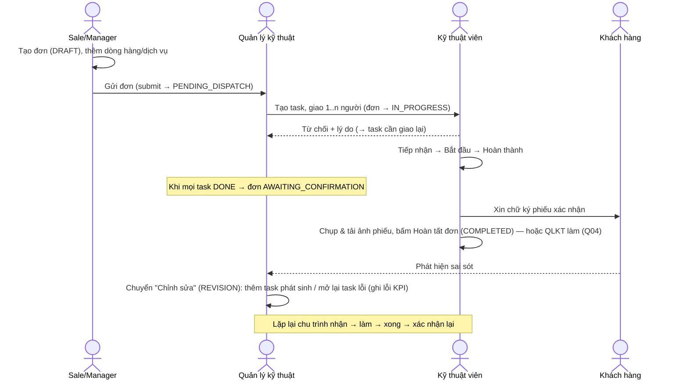
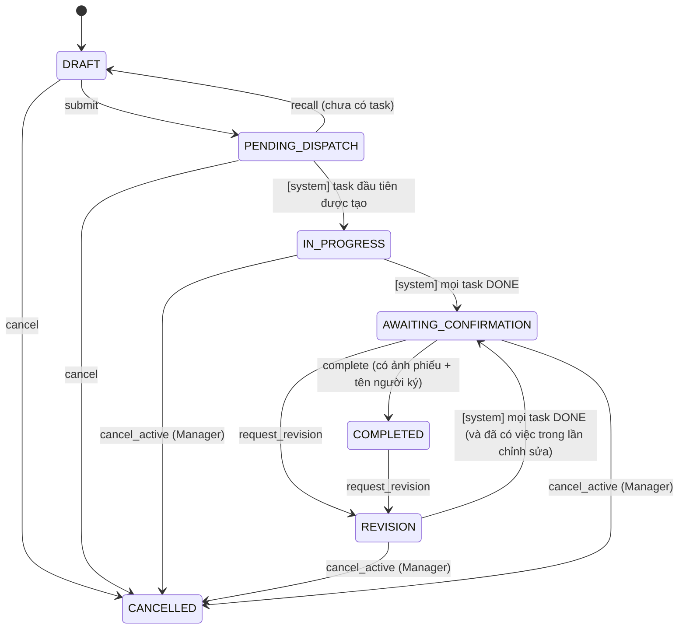
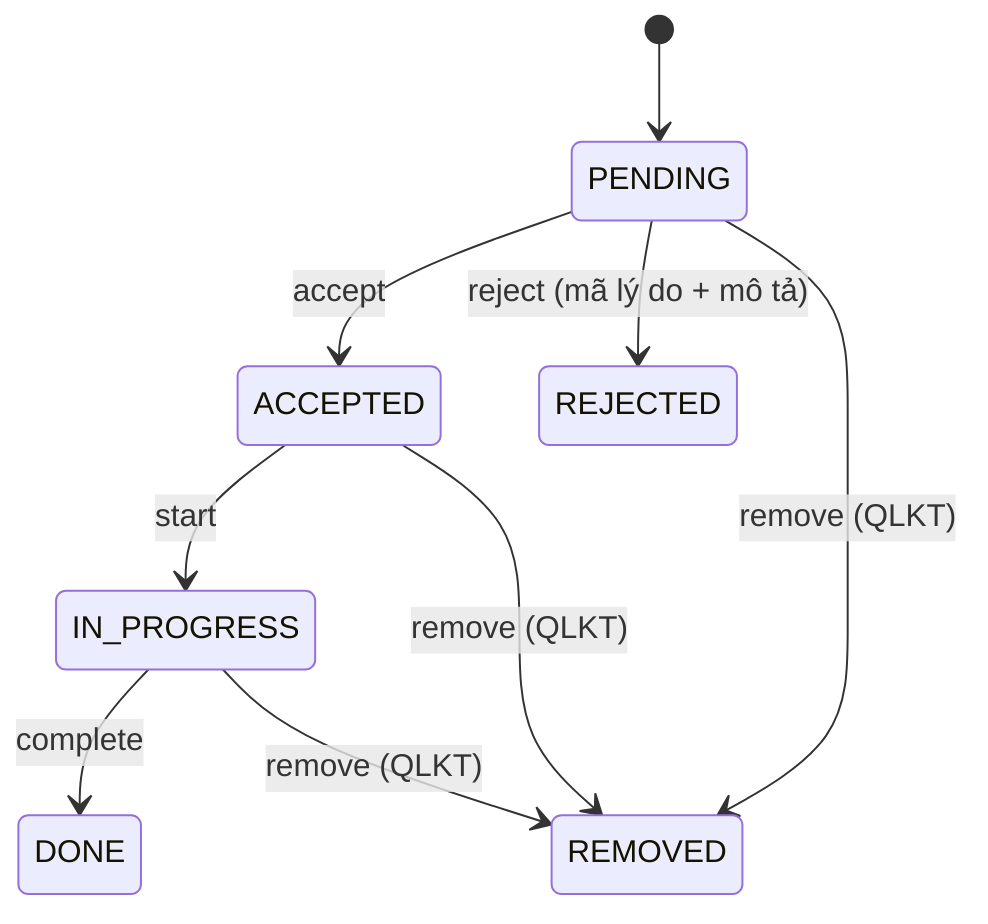

# Workflows — giải thích cho người đọc

> Nguồn sự thật là `spec/state_machines.yaml`. File này chỉ diễn giải; nếu khác nhau, YAML đúng.

## 1. Luồng tổng thể

## 2. Đơn hàng

Điểm cần lưu ý:
- **Chuyển "system"** không có API riêng; được kích hoạt bên trong cùng transaction của lệnh gây ra nó (tạo task, hoàn thành assignment, huỷ task…). Hàm `reevaluate_order(order)` là nơi duy nhất quyết định các chuyển này.
- Khi vào REVISION mà Quản lý kỹ thuật chưa thêm/mở lại task nào, đơn **không** tự nhảy về AWAITING_CONFIRMATION (guard `revision_has_work_if_revision`).
- Ảnh phiếu xác nhận gắn với `revision_no`; sau mỗi lần chỉnh sửa phải có ảnh xác nhận mới.

## 3. Đầu việc (Task) — trạng thái suy ra
Task không có lệnh "đổi trạng thái" trực tiếp. Trạng thái tính từ các assignment **đang hoạt động** (chu kỳ hiện tại, không REJECTED/REMOVED), theo thứ tự ưu tiên:

| # | Điều kiện | Trạng thái |
|---|---|---|
| 1 | Đã huỷ | CANCELLED |
| 2 | Không còn ai đang được giao | NEEDS_ASSIGNEE (cần giao lại — báo đỏ cho QLKT) |
| 3 | Tất cả DONE | DONE |
| 4 | Có ít nhất 1 người IN_PROGRESS hoặc DONE | IN_PROGRESS |
| 5 | Có người còn PENDING | PENDING_ACCEPTANCE |
| 6 | Còn lại (tất cả ACCEPTED) | ACCEPTED |

"Task hoàn thành khi tất cả nhân viên được giao đều báo hoàn thành" = dòng 3. Người đã từ chối/bị gỡ không tính.

**Mở lại (reopen)** — chỉ khi đơn ở REVISION: `cycle += 1`; các assignment chu kỳ cũ giữ nguyên (lịch sử); tạo `defect_records` cho từng người đã DONE ở chu kỳ cũ; tạo assignment PENDING mới cho người được chọn (người cũ hoặc mới).

## 4. Phân công (Assignment)

- Chỉ chính người được giao mới accept/reject/start/complete. QLKT không làm thay (❓ xem OPEN_QUESTIONS).
- Đã tiếp nhận thì không từ chối được nữa — phải liên hệ QLKT để gỡ.
- Không có đường quay lui từ DONE; sai sót xử lý bằng Chỉnh sửa đơn + reopen.

## 5. Tác dụng phụ (effects)
| Effect | Ý nghĩa |
|---|---|
| audit | ghi 1 dòng `audit_events` (from/to, actor, lý do) |
| notify_* | tạo `notifications` cho nhóm người tương ứng |
| fire_order_reevaluate | gọi `reevaluate_order` trong cùng transaction |
| record_defect_for_previous_cycle_assignees | tạo `defect_records` |
| cancel_open_tasks | huỷ task chưa DONE và gỡ các assignment mở |

## 6. Đồng thời (concurrency)
Mọi lệnh: `BEGIN` → `SELECT … FROM orders WHERE id = :id FOR UPDATE` (khoá đơn gốc, kể cả khi lệnh nhắm vào assignment) → kiểm tra `version` client gửi → áp dụng → `COMMIT`. Sai version → 409 `STALE_VERSION`, client tải lại.
